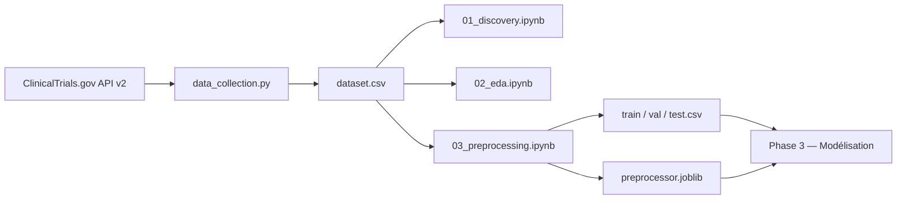

# Documentation du projet — Prédiction de l'abandon des essais cliniques

> **Projet Machine Learning** — 2ème année Génie Informatique (GI), année 2025–2026  
> **Auteurs** : El Fadil Assel, El Maaroufi Siham, El Ouazzani Touhami Aymane  
> **Source de données** : [ClinicalTrials.gov API v2](https://clinicaltrials.gov/api/v2/studies)

---

## Table des matières

1. [Contexte et problématique métier](#1-contexte-et-problématique-métier)
2. [Objectif du projet](#2-objectif-du-projet)
3. [Architecture du dépôt](#3-architecture-du-dépôt)
4. [Pipeline de données (logique globale)](#4-pipeline-de-données-logique-globale)
5. [Phase 1 — Cadrage et collecte](#5-phase-1--cadrage-et-collecte)
6. [Phase 2 — Exploration, EDA et prétraitement](#6-phase-2--exploration-eda-et-prétraitement)
7. [Variables du dataset](#7-variables-du-dataset)
8. [Décisions de modélisation](#8-décisions-de-modélisation)
9. [État d'avancement et prochaines étapes](#9-état-davancement-et-prochaines-étapes)
10. [Dépendances techniques](#10-dépendances-techniques)

---

## 1. Contexte et problématique métier

### Le monde des essais cliniques

Les essais cliniques sont l'étape finale et la plus coûteuse du développement de nouveaux médicaments et thérapies. Un essai de phase III peut coûter entre **100 et 300 millions de dollars** et mobiliser des milliers de patients sur plusieurs années.

Or, une proportion significative de ces essais **n'arrive jamais à terme** : ils sont interrompus (`TERMINATED`), suspendus (`SUSPENDED`) ou retirés (`WITHDRAWN`) avant de produire des résultats exploitables. Ces abandons représentent :

- un **gaspillage financier** pour les sponsors (industrie pharmaceutique, institutions académiques) ;
- une **exposition inutile** pour les patients volontaires ;
- un **retard sociétal** pour les systèmes de santé qui attendent ces traitements.

### La question centrale

> **Est-il possible de prédire, dès la conception d'un essai clinique et en se basant uniquement sur ses métadonnées de design, qu'il présente un risque élevé d'être abandonné avant sa complétion ?**

Il ne s'agit pas d'une analyse rétrospective après constatation de l'échec, mais d'une **détection précoce** fondée sur des informations disponibles au moment de l'enregistrement de l'essai sur ClinicalTrials.gov : phase, type de sponsor, nombre de participants prévus, type d'intervention, complexité du protocole, etc.

### Impact attendu d'un modèle fiable

| Bénéficiaire | Impact |
|---|---|
| Sponsors / R&D | Réorienter les financements vers les essais les plus susceptibles d'aboutir |
| Comités de révision | Alerter sur les conceptions à risque **avant** le lancement |
| Patients | Réduire l'exposition à des protocoles voués à l'échec |
| Systèmes de santé | Optimiser les portefeuilles de recherche clinique |

---

## 2. Objectif du projet

### Tâche ML

**Classification supervisée binaire** :

| Valeur `abandoned` | Signification | Statuts ClinicalTrials.gov |
|---|---|---|
| `0` | Essai complété | `COMPLETED` |
| `1` | Essai abandonné | `TERMINATED`, `SUSPENDED`, `WITHDRAWN` |

### Contraintes académiques respectées

| Critère | Exigence | Réalisation |
|---|---|---|
| Type de tâche | Classification supervisée | ✅ Binaire `abandoned` 0/1 |
| Taille du dataset | ≥ 10 000 lignes | ✅ **12 272 essais** collectés |
| Nombre de features | ≥ 8 après feature engineering | ✅ 16 features brutes + 4 dérivées → **53 features** après encodage |
| Classe minoritaire | 5 % – 25 % | ✅ **~13,6 %** d'abandons (ratio ~6,4:1) |
| Types de variables | Numérique + catégorielle | ✅ Mix des deux |
| Source | API publique gratuite | ✅ ClinicalTrials.gov v2, sans clé API |

### Objectifs métiers quantifiés (OM)

| ID | Objectif métier | Traduction ML | Métrique | Seuil cible |
|---|---|---|---|---|
| OM-1 | Détecter 80 % des essais abandonnés | Maximiser le recall classe 1 | **Recall** | ≥ 0,80 |
| OM-2 | Limiter les fausses alertes | Maintenir une précision acceptable | **Precision** | ≥ 0,40 |
| OM-1+2 | Équilibrer recall et precision | Synthèse des deux | **F1-score** | ≥ 0,55 |
| Global | Qualité indépendante du seuil | Évaluation robuste au déséquilibre | **PR-AUC** | À maximiser |

### Asymétrie des coûts d'erreur

Le projet adopte une logique **recall-oriented** (orientée rappel) :

```
Coût(Faux Négatif) / Coût(Faux Positif) ≈ 500 à 2000×
```

- **Faux négatif (FN)** : prédire « va se compléter » alors que l'essai sera abandonné → coût estimé **50–100 M$** (phase III).
- **Faux positif (FP)** : prédire « à risque » alors que l'essai se complèterait → coût estimé **50 000–200 000 $** (revue de protocole).

**Conséquences pratiques** : recall comme métrique principale, seuil de décision abaissé (< 0,5) en déploiement, et techniques de rééquilibrage (SMOTE, `class_weight='balanced'`) prévues en Phase 3.

---

## 3. Architecture du dépôt

```
ML_Medical_trial_prediction/
│
├── cadrage.md                    # Fiche de cadrage Phase 1 (problématique, features, métriques)
├── DATASET.md                    # Documentation détaillée du schéma de données
├── preprocessing_decisions.md    # Journal des décisions de prétraitement Phase 2
├── PROJECT_OVERVIEW.md           # Ce document
│
├── src/
│   └── data_collection.py        # Script de collecte depuis l'API ClinicalTrials.gov
│
├── notebooks/
│   ├── 01_discovery.ipynb        # Exploration initiale et validation du dataset
│   ├── 02_eda.ipynb              # Analyse exploratoire approfondie (EDA)
│   └── 03_preprocessing.ipynb    # Nettoyage, feature engineering, pipeline sklearn
│
├── data/
│   ├── dataset.csv               # Dataset principal (12 272 lignes × 17 colonnes)
│   ├── sample.csv                # Extrait de 100 lignes (échantillon stratifié)
│   ├── raw/                      # Pages JSON brutes (gitignored)
│   └── processed/
│       ├── train.csv             # 8 563 lignes × 54 colonnes (53 features + cible)
│       ├── validation.csv        # 1 836 lignes
│       └── test.csv              # 1 836 lignes
│
├── models/
│   └── preprocessor.joblib       # Pipeline sklearn sérialisé (fit sur train uniquement)
│
└── logs/                         # Logs de collecte (gitignored)
```

> **Note** : Un notebook `01_discovery.ipynb` existe aussi à la racine du projet (copie ou version antérieure). La version de référence se trouve dans `notebooks/`.

---

## 4. Pipeline de données (logique globale)



### Principe fondamental : features « design-time only »

**Toutes les variables d'entrée doivent être connues au moment de la conception de l'essai**, avant le début du recrutement. Aucune information post-hoc n'est admise.

**Variables explicitement exclues** :
- dates d'enrollment réelles ;
- nombre de participants effectivement recrutés ;
- résultats intermédiaires ou rapports de sécurité ;
- raisons d'arrêt (`why_stopped`) ;
- date effective d'arrêt.

Ce principe garantit qu'un modèle déployé pourrait, en théorie, scorer un nouvel essai **dès son enregistrement** sur ClinicalTrials.gov.

---

## 5. Phase 1 — Cadrage et collecte

### 5.1 Fiche de cadrage (`cadrage.md`)

Documente la problématique métier, les 17 features initialement identifiées, la variable cible, les objectifs métiers quantifiés, la traduction métier → ML, et l'analyse du coût asymétrique des erreurs.

### 5.2 Script de collecte (`src/data_collection.py`)

#### Fonctionnement

1. **Requête paginée** vers `https://clinicaltrials.gov/api/v2/studies`
   - Filtre : `filter.overallStatus=COMPLETED|TERMINATED|SUSPENDED|WITHDRAWN`
   - Taille de page : 1 000 (maximum API)
   - Délai entre requêtes : 0,5 s (respect du rate limiting)
   - Retry exponentiel en cas d'erreur réseau, timeout ou HTTP 429/5xx

2. **Sauvegarde brute** de chaque page JSON dans `data/raw/page_XXXX.json`

3. **Extraction des features** via `extract_features(study)` :
   - Parcourt la structure JSON `protocolSection` de l'API v2
   - Accès sécurisé aux champs imbriqués via `safe_get()`
   - Filtre les essais sans `allocation` valide (retourne `None`)
   - Construit la variable cible `abandoned` à partir du statut final

4. **Post-traitement** via `build_dataframe()` :
   - Calcul de `outcomes_ratio = n_secondary_outcomes / max(n_primary_outcomes, 1)`
   - Suppression des doublons sur `nct_id`
   - Rapport de qualité (distribution cible, % manquants)

5. **Sauvegarde** :
   - `data/dataset.csv` — dataset complet
   - `data/sample.csv` — échantillon stratifié de 100 lignes
   - `data/dataset.parquet` — format optionnel (si `pyarrow` installé)

#### Usage en ligne de commande

```bash
cd src
python data_collection.py                  # collecte complète (défaut : 12 000 lignes max)
python data_collection.py --sample 100     # mode test rapide
python data_collection.py --max 5000       # limiter à N lignes
```

#### Mapping API → colonnes du dataset

| Colonne CSV | Source API (module.champ) | Logique d'extraction |
|---|---|---|
| `phase` | `designModule.phases` | Première phase ou concaténation si multiples ; `"NA"` si absent |
| `sponsor_type` | `sponsorCollaboratorsModule.leadSponsor.class` | INDUSTRY, NIH, FED, etc. |
| `enrollment_count` | `designModule.enrollmentInfo` | Count si type ESTIMATED ou ACTUAL |
| `intervention_type` | `armsInterventionsModule.interventions[0].type` | Type de la première intervention |
| `n_arms` | `armsInterventionsModule.armGroups` | Nombre de bras (longueur de la liste) |
| `has_dmc` | `oversightModule.oversightHasDmc` | Booléen → 0/1 ; `None` si absent |
| `allocation` | `designModule.designInfo.allocation` | Obligatoire (essai exclu si absent/NA) |
| `masking` | `designModule.designInfo.maskingInfo.masking` | NONE, SINGLE, DOUBLE, etc. |
| `primary_purpose` | `designModule.designInfo.primaryPurpose` | TREATMENT, PREVENTION, etc. |
| `n_primary_outcomes` | `outcomesModule.primaryOutcomes` | Nombre de critères principaux |
| `n_secondary_outcomes` | `outcomesModule.secondaryOutcomes` | Nombre de critères secondaires |
| `n_locations` | `contactsLocationsModule.locations` | Nombre de sites |
| `is_multicenter` | dérivée | `1` si `n_locations > 1` |
| `has_us_site` | dérivée | `1` si au moins un site aux États-Unis |
| `n_collaborators` | `sponsorCollaboratorsModule.collaborators` | Nombre de collaborateurs |
| `abandoned` | `statusModule.overallStatus` | 1 si TERMINATED/SUSPENDED/WITHDRAWN, sinon 0 |

### 5.3 Dataset actuel (`data/dataset.csv`)

| Caractéristique | Valeur |
|---|---|
| Lignes | **12 272** |
| Colonnes | **17** (16 features + cible) |
| Classe 0 (complété) | **86,4 %** |
| Classe 1 (abandonné) | **13,6 %** |

**Valeurs manquantes principales** :

| Variable | % manquant |
|---|---|
| `phase` | 48,7 % |
| `has_dmc` | 16,5 % |
| `enrollment_count` | 3,3 % |

> **Écart documentation / code** : `DATASET.md` et le notebook `01_discovery.ipynb` décrivent une version enrichie du dataset (23 colonnes incluant `nct_id`, `overall_status`, `study_duration_days`, `log_enrollment`, `log_duration`, `condition_category`). La version actuelle de `dataset.csv` et de `data_collection.py` ne contient que **17 colonnes**. Les features dérivées (`log_enrollment`, `log_n_locations`, etc.) sont créées dans le notebook de prétraitement, pas lors de la collecte.

---

## 6. Phase 2 — Exploration, EDA et prétraitement

### 6.1 Notebook `01_discovery.ipynb` — Exploration initiale

**Objectif** : Valider que le dataset est exploitable avant la Phase 2.

**Contenu implémenté** :
1. Chargement et inspection de la structure (`shape`, `dtypes`, `head`)
2. Statistiques descriptives globales
3. Analyse de la variable cible `abandoned` (distribution, graphiques en barres et camembert)
4. Cartographie des valeurs manquantes par colonne
5. Analyse des taux d'abandon par modalité catégorielle (`phase`, `sponsor_type`, etc.)
6. Comparaison des distributions numériques entre classes (boxplots)
7. Vérification des contraintes du projet (taille, déséquilibre, nombre de features)

**Conclusion du notebook** : le dataset est exploitable ; déséquilibre ~14 % conforme ; toutes les features sont design-time.

### 6.2 Notebook `02_eda.ipynb` — Analyse exploratoire approfondie

**Objectif** : Comprendre les distributions, les relations avec la cible, et identifier les features porteuses de signal.

**Sections implémentées** :

| Section | Contenu |
|---|---|
| **1. Analyse univariée** | Histogrammes + KDE, boxplots, stats descriptives pour variables numériques, catégorielles et binaires |
| **2. Analyse bivariée** | Taux d'abandon par modalité, heatmap de corrélation, détection des paires fortement corrélées |
| **3. Comparaison inter-classes** | Stats descriptives séparées classe 0 vs classe 1, tests statistiques de signal |
| **4. Déséquilibre** | Visualisation du ratio majoritaire/minoritaire, recommandations SMOTE / class weights |
| **5. Synthèse** | Rapport programmatique : manquants, déséquilibre, features significatives, outliers, corrélations, modalités rares |

**Tests statistiques utilisés** :
- **Mann-Whitney U** (variables numériques, non paramétrique) avec rank-biserial correlation comme taille d'effet
- **Chi-carré** (variables catégorielles et binaires) avec Cramér's V comme taille d'effet

### 6.3 Notebook `03_preprocessing.ipynb` — Nettoyage et pipeline

**Objectif** : Préparer les données pour la modélisation (Phase 3) sans fuite d'information.

#### Étape 1 — Valeurs manquantes

| Variable | Action immédiate | Action pipeline |
|---|---|---|
| `phase` | Remplir par `"NA"` | — (déjà traité) |
| `has_dmc` | — | Imputation par mode (0) dans le pipeline |
| `enrollment_count` | — | Imputation par médiane dans le pipeline |

#### Étape 2 — Doublons et incohérences

- Suppression des lignes dupliquées exactes
- Suppression des lignes avec `enrollment_count < 0`
- Correction de `is_multicenter` : remis à `0` si `n_locations <= 1`

#### Étape 3 — Outliers (Winsorisation)

- Détection par méthode IQR sur 7 variables numériques
- **Décision** : conserver toutes les lignes (les extrêmes sont réels en contexte clinique)
- **Mitigation** : winsorisation au **1er et 99e centile** via `df[col].clip()`

#### Étape 4 — Feature engineering

| Feature dérivée | Formule | Justification métier |
|---|---|---|
| `log_enrollment` | `log1p(enrollment_count)` | Réduit l'asymétrie à droite de l'enrollment |
| `log_n_locations` | `log1p(n_locations)` | Stabilise la variance du nombre de sites |
| `protocol_complexity` | `n_arms × n_primary_outcomes` | Protocoles complexes = plus de risque opérationnel |
| `enrollment_per_site` | `enrollment_count / (n_locations + 1)` | Pression de recrutement par site |

#### Étape 5 — Split train / validation / test

```
Total (12 272) ──► 70 % Train (8 563)
              └──► 30 % Temp ──► 50/50 ──► 15 % Val (1 836) + 15 % Test (1 836)
```

- **Stratification** sur `abandoned` (ratio ~86/14 préservé dans chaque split)
- `random_state=42`
- Split effectué **avant** tout fit du pipeline (anti-fuite)

#### Étape 6 — Pipeline sklearn (`ColumnTransformer`)

```
preprocessor
├── num_pipe (11 colonnes numériques)
│   ├── SimpleImputer(strategy='median')
│   └── RobustScaler()
├── cat_pipe (6 colonnes catégorielles)
│   ├── SimpleImputer(strategy='most_frequent')
│   └── OneHotEncoder(drop='first', handle_unknown='ignore')
└── bin_pipe (3 colonnes binaires)
    └── SimpleImputer(strategy='most_frequent')
```

**Colonnes exclues du pipeline** (via `remainder='drop'`) : colonnes méta non listées (`nct_id`, `overall_status`, `condition_category` si présentes).

**Résultat après transformation** : **53 features** encodées + colonne cible.

#### Étape 7 — Persistance

| Artefact | Chemin | Description |
|---|---|---|
| Jeux transformés | `data/processed/train.csv`, `validation.csv`, `test.csv` | Features scalées/encodées prêtes pour ML |
| Pipeline sérialisé | `models/preprocessor.joblib` | Reproductibilité et inférence future |

#### Étape 8 — Stratégies de déséquilibre (préparées, non appliquées en production)

Quatre stratégies documentées pour la Phase 3 :

1. **Aucun rééchantillonnage** — `class_weight='balanced'` dans le modèle
2. **SMOTE** — sur-échantillonnage synthétique de la classe minoritaire
3. **RandomUnderSampler** — sous-échantillonnage de la classe majoritaire
4. **SMOTETomek** — combinaison SMOTE + nettoyage des frontières

> Ces stratégies sont testées en preview sur `X_train_processed` uniquement ; elles ne modifient pas les fichiers sauvegardés.

---

## 7. Variables du dataset

### Variables brutes (collecte)

#### Catégorielles

| Variable | Modalités principales |
|---|---|
| `phase` | PHASE1, PHASE2, PHASE3, PHASE4, PHASE1/PHASE2, PHASE2/PHASE3, NA, EARLY_PHASE1 |
| `sponsor_type` | INDUSTRY, NIH, FED, OTHER, INDIV, NETWORK, UNKNOWN |
| `intervention_type` | DRUG, DEVICE, BIOLOGICAL, PROCEDURE, RADIATION, BEHAVIORAL, etc. |
| `allocation` | RANDOMIZED, NON_RANDOMIZED |
| `masking` | NONE, SINGLE, DOUBLE, TRIPLE, QUADRUPLE |
| `primary_purpose` | TREATMENT, PREVENTION, DIAGNOSTIC, SUPPORTIVE_CARE, etc. |

#### Numériques

| Variable | Description | Plage typique |
|---|---|---|
| `enrollment_count` | Participants prévus | 1 – 100 000+ |
| `n_arms` | Nombre de bras du protocole | 0 – 10+ |
| `n_primary_outcomes` | Critères de jugement principaux | 0 – 20+ |
| `n_secondary_outcomes` | Critères de jugement secondaires | 0 – 100+ |
| `outcomes_ratio` | Ratio secondaires / principaux | 0 – 100+ |
| `n_locations` | Sites de recrutement | 0 – 5 000+ |
| `n_collaborators` | Institutions collaboratrices | 0 – 50+ |

#### Binaires

| Variable | Description |
|---|---|
| `has_dmc` | Présence d'un comité de surveillance des données (DSMB) |
| `is_multicenter` | Essai sur plusieurs sites |
| `has_us_site` | Au moins un site aux États-Unis |

### Variables dérivées (prétraitement)

| Variable | Formule |
|---|---|
| `log_enrollment` | `log1p(enrollment_count)` |
| `log_n_locations` | `log1p(n_locations)` |
| `protocol_complexity` | `n_arms × n_primary_outcomes` |
| `enrollment_per_site` | `enrollment_count / (n_locations + 1)` |

### Variable cible

| Variable | Type | Distribution actuelle |
|---|---|---|
| `abandoned` | Binaire (0/1) | 86,4 % complétés / 13,6 % abandonnés |

---

## 8. Décisions de modélisation

### Métriques retenues

| Métrique | Rôle | Pourquoi |
|---|---|---|
| **Recall (classe 1)** | Principale | Minimise les FN coûteux (OM-1) |
| **Precision (classe 1)** | Contrainte | Évite l'explosion des fausses alertes (OM-2) |
| **F1-score (classe 1)** | Équilibre | Sélection de modèle |
| **PR-AUC** | Globale | Robuste au déséquilibre, indépendante du seuil |

**Métriques exclues comme principales** :
- ~~Accuracy~~ : trompeuse (~86 % avec un modèle naïf « tout = 0 »)
- ~~ROC-AUC seule~~ : optimiste sur données déséquilibrées

### Anti-fuite de données (data leakage)

Toutes les statistiques d'imputation (médiane, mode) et de mise à l'échelle (RobustScaler) sont **fitées exclusivement sur `X_train`**, puis appliquées à validation et test via le pipeline sérialisé.

### Prévention des fuites conceptuelles

Seules des features **design-time** sont utilisées. Le modèle ne « triche » pas en utilisant des informations connues uniquement après l'abandon.

---

## 9. État d'avancement et prochaines étapes

### Ce qui est implémenté ✅

| Phase | Livrable | Statut |
|---|---|---|
| **Phase 1** | Cadrage métier (`cadrage.md`) | ✅ Terminé |
| **Phase 1** | Documentation dataset (`DATASET.md`) | ✅ Terminé |
| **Phase 1** | Script de collecte API (`data_collection.py`) | ✅ Terminé |
| **Phase 1** | Dataset brut (`dataset.csv`, 12 272 lignes) | ✅ Terminé |
| **Phase 2** | Exploration initiale (`01_discovery.ipynb`) | ✅ Terminé |
| **Phase 2** | EDA approfondie (`02_eda.ipynb`) | ✅ Terminé |
| **Phase 2** | Prétraitement + pipeline (`03_preprocessing.ipynb`) | ✅ Terminé |
| **Phase 2** | Jeux train/val/test transformés | ✅ Terminé |
| **Phase 2** | Pipeline sérialisé (`preprocessor.joblib`) | ✅ Terminé |
| **Phase 2** | Journal des décisions (`preprocessing_decisions.md`) | ✅ Terminé |

### Ce qui reste à faire ⏳ (Phase 3 — Modélisation)

D'après le cadrage et les notebooks, la Phase 3 devrait inclure :

1. **Baseline models** : Dummy Classifier → Régression logistique → Random Forest → XGBoost
2. **Gestion du déséquilibre** : comparer les 4 stratégies préparées (class weights, SMOTE, undersampling, SMOTETomek)
3. **Optimisation d'hyperparamètres** : GridSearch / RandomSearch avec validation croisée stratifiée
4. **Évaluation** : recall, precision, F1, PR-AUC sur le jeu de test
5. **Interprétabilité** : feature importance (OM-3) pour les comités de révision
6. **Choix du seuil de décision** : abaisser sous 0,5 pour favoriser le recall

Aucun notebook ou script de modélisation n'existe encore dans le dépôt.

---

## 10. Dépendances techniques

Le projet n'inclut pas de `requirements.txt`, mais les dépendances identifiées dans le code sont :

| Package | Usage |
|---|---|
| `pandas` | Manipulation de données |
| `numpy` | Calculs numériques |
| `requests` | Appels API ClinicalTrials.gov |
| `matplotlib` | Visualisations |
| `seaborn` | Visualisations statistiques |
| `scipy` | Tests statistiques (Mann-Whitney, chi-carré) |
| `scikit-learn` | Pipeline, split, imputation, scaling, encodage |
| `imbalanced-learn` | SMOTE, RandomUnderSampler, SMOTETomek |
| `joblib` | Sérialisation du preprocessor |
| `pyarrow` | Export Parquet (optionnel) |

**Environnement** : Python 3.10 (d'après les métadonnées des notebooks).

---

## Annexe — Flux de travail recommandé

```bash
# 1. Collecter les données (depuis src/)
cd src
python data_collection.py

# 2. Explorer et valider
jupyter notebook notebooks/01_discovery.ipynb
jupyter notebook notebooks/02_eda.ipynb

# 3. Prétraiter et générer les jeux ML
jupyter notebook notebooks/03_preprocessing.ipynb

# 4. (À venir) Entraîner et évaluer les modèles
# jupyter notebook notebooks/04_modeling.ipynb
```

---

*Document généré à partir de l'analyse du code source, des notebooks et de la documentation existante — Juin 2025.*
